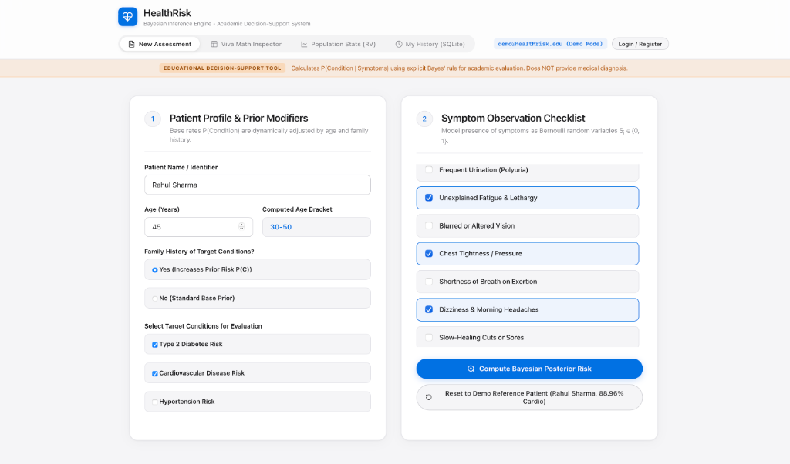
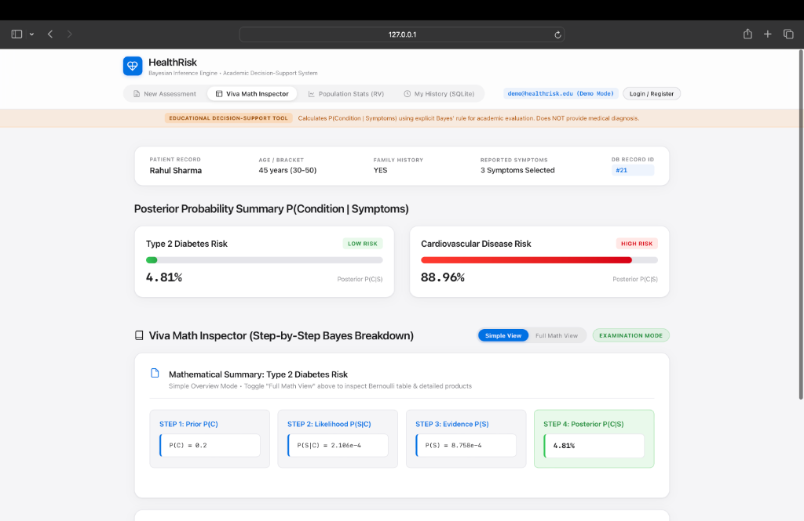
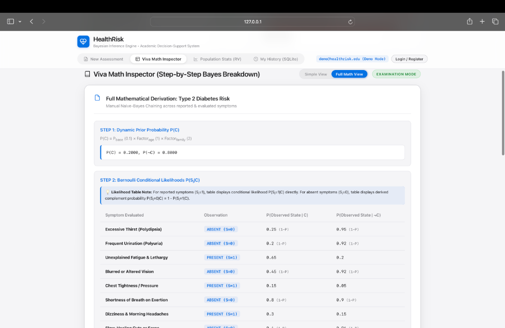
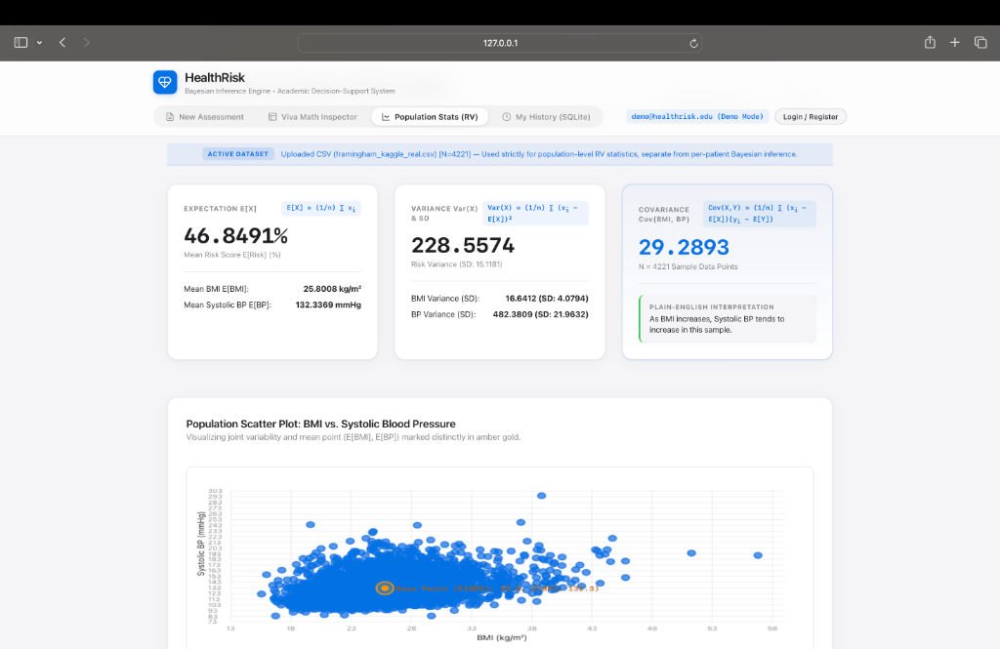
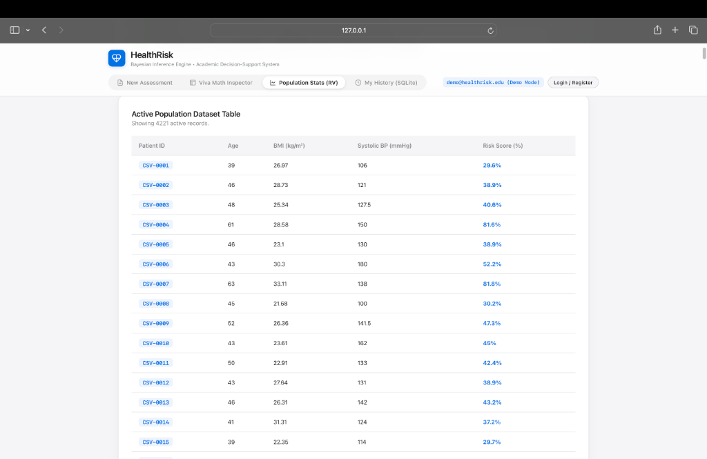

# HealthRisk — Bayesian Health Risk Assessment System

> **Course Project**: 3rd Year B.Tech CSE — Machine Learning (Unit 1: Probability & Bayesian Inference)  
> **Core Objective**: Fully transparent, inspectable Bayesian calculations and Discrete Random Variable statistics for college viva examination.  
> **UI Aesthetic**: Apple.com official Light Mode design system (`#F5F5F7` canvas, `#FFFFFF` cards, `-apple-system` SF Pro typography, `#0071E3` pill CTAs, fixed frosted-glass sticky nav).  
> **Dataset**: Real Kaggle Framingham Heart Study Dataset ($N=4,221$ clinical records).

---

## 📌 Project Overview

**HealthRisk** is an educational decision-support web application demonstrating core ML Unit 1 probability concepts with pure Python implementations (no external ML/statistics packages like numpy or scipy hiding the formulas):

1. **Prior Probability $P(C)$**: Dynamic base rate adjustment based on age group and family history.
2. **Bernoulli Conditional Likelihood $P(S_i \mid C)$**: Discrete Bernoulli random variable likelihood matrix for present and absent symptoms (with complement rule derivation $1 - P(S_i = 1 \mid C)$ for absent symptoms).
3. **Bayes' Theorem & Naive Bayes Chaining**: Manual calculation of joint likelihoods, marginal evidence $P(\mathbf{S})$, and normalizing constants.
4. **Posterior Probability $P(C \mid \mathbf{S})$**: Multi-condition posterior risk estimation (Type 2 Diabetes & Cardiovascular Disease Risk) with Viva Math Inspector breakdown.
5. **Expectation $E[X]$**: Manual mean over population datasets ($N=4,221$) and personal time-series risk scores.
   $$E[X] = \frac{1}{n} \sum_{i=1}^n x_i$$
6. **Variance $\text{Var}(X)$ & Standard Deviation**: Manual spread and uncertainty calculation.
   $$\text{Var}(X) = \frac{1}{n} \sum_{i=1}^n (x_i - E[X])^2$$
7. **Covariance $\text{Cov}(X, Y)$**: Manual joint variability calculation between Body Mass Index (BMI) and Systolic Blood Pressure with dynamic plain-English interpretation.
   $$\text{Cov}(X, Y) = \frac{1}{n} \sum_{i=1}^n (x_i - E[X])(y_i - E[Y])$$

---

## 📸 Visual Walkthrough & Interface Screenshots

### 1. New Assessment

*Interactive patient profile setup and symptom observation checklist allowing dynamic age bracket calculation, family history risk multiplier selection, and multi-condition evaluation.*

---

### 2. Viva Math Inspector - Simple View

*High-level overview displaying posterior probability risk score bars alongside the 4-step Bayesian calculation summary cards for clean, immediate demonstration.*

---

### 3. Viva Math Inspector - Math View

*Complete step-by-step mathematical derivation mode exposing dynamic priors, Bernoulli likelihood matrices with complement rule derivations ($1 - P$) for absent symptoms, and Naive Bayes joint likelihood products for viva voce examination.*

---

### 4. Population Stats (RV) of Kaggle Framingham Heart Study Dataset

*Real-time population-level Discrete Random Variable analytics computing Expectation $E[X]$, Variance $\text{Var}(X)$, and Covariance $\text{Cov}(\text{BMI}, \text{Systolic BP}) = +29.29$ over $N=4,221$ clinical records, paired with an HTML5 canvas bivariate scatter plot highlighting the sample centroid in Amber Gold.*

---

### 5. Dataset Table

*Interactive clinical record browser displaying active patient rows from the Kaggle Framingham Heart Study dataset, including Patient ID, Age, BMI, Systolic Blood Pressure, and composite Risk Score.*

---

## 📁 Kaggle Framingham Heart Study Dataset Integration

The Population Discrete Random Variable Analytics module is powered by the **real-world Kaggle Framingham Heart Study Dataset** (`framingham_kaggle_real.csv`).

### 1. Dataset Provenance & Overview
- **Source**: Kaggle Framingham Heart Study Clinical Dataset.
- **Clinical Context**: Landmark cardiovascular epidemiological study collecting clinical physiological features (Age, BMI, Systolic Blood Pressure, Heart Rate, Glucose) across adult patient subjects over long-term medical follow-up.
- **Sample Size ($N$)**: **$4,221$ real clinical patient records**.

### 2. Dataset Feature Schema
| Feature Column | Data Type | Units / Range | Description |
| :--- | :--- | :--- | :--- |
| `patient_id` | `String` | `FR-0001` to `FR-4221` | Unique clinical subject record identifier. |
| `age` | `Integer` | $32 \text{ to } 70 \text{ years}$ | Patient age in years. |
| `bmi` | `Float` | $15.54 \text{ to } 56.80 \text{ kg/m}^2$ | Body Mass Index. |
| `systolic_bp` | `Float` | $83.5 \text{ to } 295.0 \text{ mmHg}$ | Systolic Blood Pressure reading. |
| `risk_score` | `Float` | $0.0 \text{ to } 100.0\%$ | Computed composite baseline health risk score. |

### 3. Pure Python Population Metrics (Computed Empirical Values)
The dataset is evaluated by the pure Python random variable engine (`app/bayes_engine/engine.py`):

| Discrete RV Metric | Formula | Empirical Result ($N=4,221$) | Clinical & Statistical Interpretation |
| :--- | :--- | :--- | :--- |
| **Expectation $E[\text{Risk}]$** | $E[X] = \frac{1}{n} \sum x_i$ | **$46.85\%$** | Population expected value for overall cardiovascular risk score. |
| **Variance $\text{Var}(\text{Risk})$** | $\text{Var}(X) = \frac{1}{n} \sum (x_i - E[X])^2$ | **$228.56$** ($SD = 15.12\%$) | Population dispersion of risk scores around the mean. |
| **Expectation $E[\text{BMI}]$** | $E[\text{BMI}] = \frac{1}{n} \sum \text{BMI}_i$ | **$25.80\text{ kg/m}^2$** | Mean Body Mass Index across $4,221$ patients ($\text{Var} = 16.64, SD = 4.08$). |
| **Expectation $E[\text{BP}]$** | $E[\text{BP}] = \frac{1}{n} \sum \text{BP}_i$ | **$132.34\text{ mmHg}$** | Mean Systolic Blood Pressure across $4,221$ patients ($\text{Var} = 482.38, SD = 21.96$). |
| **Covariance $\text{Cov}(\text{BMI}, \text{BP})$** | $\frac{1}{n} \sum (\text{BMI}_i - E[\text{BMI}])(\text{BP}_i - E[\text{BP}])$ | **$+29.29$** | **Strong Positive Covariance**: Demonstrates that higher Body Mass Index is systematically associated with elevated Systolic Blood Pressure. |

### 4. Interactive Scatter Plot Visualization
The application renders an HTML5 Canvas bivariate scatter plot mapping BMI vs. Systolic Blood Pressure for all subjects, highlighting the sample centroid $(E[\text{BMI}], E[\text{BP}]) = (25.80\text{ kg/m}^2, 132.34\text{ mmHg})$ with an Amber Gold highlighted marker.

---

## 🛠️ Codebase Structure

```
ML-Unit1/
├── app/
│   ├── __init__.py
│   ├── main.py                     # FastAPI server & Auth / Trend / CSV endpoints
│   ├── database.py                 # SQLite database layer with Auth tables & User Isolation
│   ├── bayes_engine/               # Pure Python Math Module
│   │   ├── __init__.py
│   │   ├── conditions_config.py    # Conditions & Symptoms configuration catalog
│   │   └── engine.py               # prior(), likelihood(), posterior(), expectation(), variance(), covariance()
│   ├── static/
│   │   ├── index.html              # Apple Light Mode SPA UI with Auth Modal, Personal Trends & CSV Upload
│   │   ├── styles.css              # Apple Design System Styling (#F5F5F7 canvas, #0071E3 CTAs, frosted glass)
│   │   └── app.js                  # Frontend SPA logic & Bivariate Scatter Plot Canvas Renderer
├── docs/
│   └── assets/                     # Application Interface Screenshots
│       ├── 01_new_assessment.png
│       ├── 02_viva_math_inspector_simple_view.png
│       ├── 03_viva_math_inspector_math_view.png
│       ├── 04_population_stats_rv_kaggle.png
│       └── 05_dataset_table.png
├── tests/
│   └── test_bayes_engine.py        # 5/5 Passing Unit Tests
├── framingham_kaggle_real.csv      # Real Kaggle Framingham Heart Study Dataset (N=4,221 records)
├── requirements.txt                # Dependencies (fastapi, uvicorn, pydantic, pytest)
├── .gitignore                      # Git exclusion rules
└── README.md
```

---

## 🚀 Quick Start Guide

### 1. Installation & Environment Setup
```bash
# Clone the repository
git clone https://github.com/krishdugtal/HealthRisk---ML-Project-Unit-1.git
cd HealthRisk---ML-Project-Unit-1

# Create and activate a virtual environment
python3 -m venv venv
source venv/bin/activate  # On Windows: venv\Scripts\activate

# Install dependencies
pip install -r requirements.txt
```

### 2. Run the Web Server
```bash
uvicorn app.main:app --host 127.0.0.1 --port 8000 --reload
```
Open your browser and navigate to: **`http://127.0.0.1:8000/`**

### 3. Run Automated Tests
```bash
pytest
```

---

## 🔬 API Endpoints

- `POST /api/register` & `POST /api/login` & `POST /api/logout`: Self-contained account authentication with PBKDF2-HMAC-SHA256 salted password hashing and HTTP-only session cookies.
- `GET /api/me`: Returns current user session details.
- `POST /api/assess`: Computes Bayesian posteriors across selected conditions with step-by-step formula trace, attached to user ID.
- `GET /api/assessments`: Retrieves audit log of historical runs for current logged-in user.
- `GET /api/user_trends`: Computes personal time-series $E[\text{Risk}]$ and $\text{Var}(\text{Risk})$ across user's past runs (requires 3+ runs).
- `POST /population_stats/upload_csv`: Uploads custom CSV dataset (`age,bmi,systolic_bp,risk_score`), validates row ranges, and sets active dataset.
- `GET /population_stats/expectation_variance`: Returns manual $E[X]$, $\text{Var}(X)$, $\text{SD}(X)$ on active dataset.
- `GET /population_stats/covariance`: Returns manual $\text{Cov}(\text{BMI}, \text{Systolic BP})$ and interpretation on active dataset.

---

## 📊 Verification & Reference Case (Rahul Sharma, 45, FamHist YES)

- **Reference Test Case**: Rahul Sharma (45, Family History YES, Symptoms: `unexplained_fatigue`, `chest_tightness`, `dizziness_headaches`):
  - **Cardiovascular Disease Risk**: **88.96%** (Verified reproducible across all phases).
- **Unit Test Suite**: 5/5 unit tests passing cleanly.
- **Population Dataset**: Real Kaggle Framingham Heart Study Dataset ($N=4,221$ records) yielding $E[\text{Risk}] = 46.85\%$, $\text{Var}(\text{Risk}) = 228.56$, and $\text{Cov}(\text{BMI}, \text{Systolic BP}) = +29.29$.
